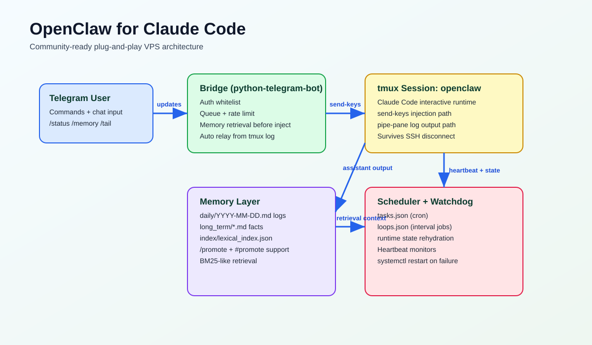
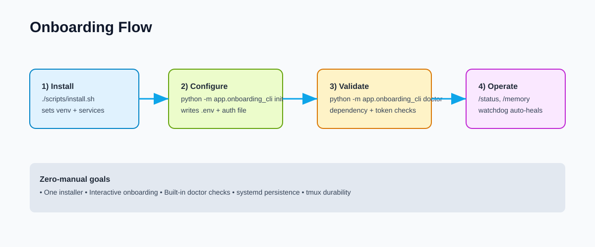

# OpenClaw for Claude Code

OpenClaw is a production-minded, self-hosted autonomous agent runtime for VPS deployments using Claude Code as the core execution engine.




## What You Get
- 24/7 runtime in persistent `tmux`
- Near-zero-latency Telegram bridge (`send-keys` injection)
- Daily + long-term memory with retrieval
- Scheduled cron tasks + recurring loops
- Watchdog-based crash recovery and self-restart
- `systemd` services for boot persistence
- Onboarding CLI (`init`, `doctor`, `print-env`)

## Quick Install (Ubuntu 22.04+)

### Option A: Clone and install
```bash
git clone https://github.com/vaibhavjnf/openclaw-claudecode.git
cd openclaw-claudecode
chmod +x scripts/*.sh
./scripts/install.sh
```

### Option B: Remote bootstrap
```bash
curl -fsSL https://raw.githubusercontent.com/vaibhavjnf/openclaw-claudecode/main/scripts/install_remote.sh | bash
```

## Onboarding CLI

Run interactive setup:
```bash
sudo -u openclaw /opt/openclaw/venv/bin/python -m app.onboarding_cli init
```

Run diagnostics:
```bash
sudo -u openclaw /opt/openclaw/venv/bin/python -m app.onboarding_cli doctor
```

Print loaded config (token masked):
```bash
sudo -u openclaw /opt/openclaw/venv/bin/python -m app.onboarding_cli print-env
```

## Telegram Admin Commands
- `/status`
- `/restart runtime|bridge|scheduler`
- `/memory <query>`
- `/tail [lines]`
- `/tasks`
- `/loops`
- `/promote [profile.md|knowledge.md|projects.md|learnings.md] <fact>`

## Service Management
```bash
sudo systemctl status openclaw-runtime openclaw-bridge openclaw-scheduler openclaw-watchdog --no-pager
sudo systemctl restart openclaw-runtime openclaw-bridge openclaw-scheduler openclaw-watchdog
```

## Project Layout
```text
openclaw/
  app/        # runtime, memory, retrieval, scheduler, watchdog, onboarding CLI
  bridge/     # telegram bridge runtime
  config/     # tasks/loops/authorized users
  docs/       # community docs + architecture images
  scripts/    # installer, packaging, tmux ops, onboarding wrapper
  services/   # systemd + logrotate configs
  memory/     # daily + long-term + index
  logs/       # runtime logs and audit trail
```

## Release Packaging
```bash
chmod +x scripts/package_release.sh
./scripts/package_release.sh v0.1.0
ls -lh dist/
```

## Quality Gates
```bash
python scripts/smoke_test.py
pytest -q
ruff check app bridge tests
pip-audit -r requirements.txt -r dev-requirements.txt
```

## Docs
- [Getting Started](docs/GETTING_STARTED.md)
- [Operations](docs/OPERATIONS.md)
- [Security](docs/SECURITY.md)
- [Contributing](docs/CONTRIBUTING.md)
- [FAQ](docs/FAQ.md)
- [UX Review](docs/UX_REVIEW.md)
- [QA Report](docs/QA_REPORT.md)

## References
- [Claude Code Quickstart](https://code.claude.com/docs/en/quickstart)
- [Claude Code Memory](https://code.claude.com/docs/en/memory)
- [python-telegram-bot](https://docs.python-telegram-bot.org/en/stable/)
- [Telegram Bot API](https://core.telegram.org/bots/api)
- [systemd.service](https://www.freedesktop.org/software/systemd/man/systemd.service.html)
- [tmux manpage](https://manpages.ubuntu.com/manpages/trusty/man1/tmux.1.html)
